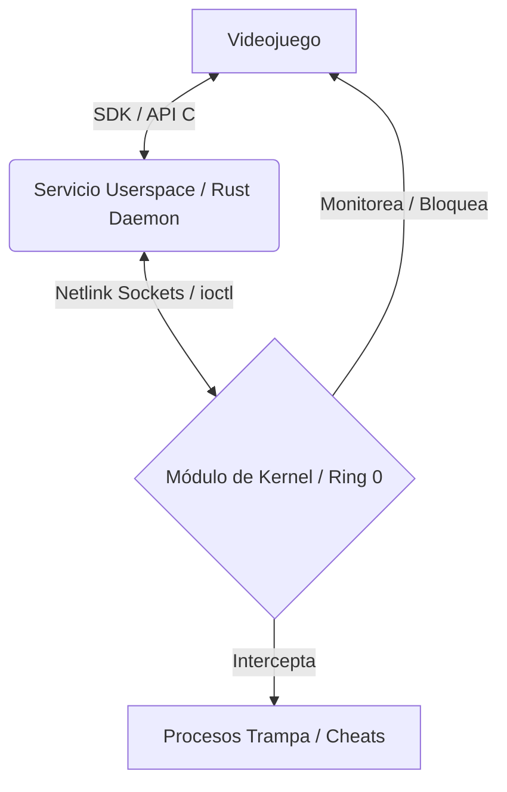

# Contexto del Proyecto: Quark Anticheat

Este documento resume el contexto y la arquitectura de **Quark Anticheat**, sirviendo como guía de referencia rápida para otros modelos de lenguaje (LLMs) y desarrolladores.

## 1. Origen del Problema
En el ecosistema de videojuegos en línea de GNU/Linux, existe una importante exclusión: muchos juegos competitivos populares exigen sistemas anticheat que funcionen a nivel de kernel (Ring 0). Dado que los anticheats comerciales más comunes (como Easy Anti-Cheat o BattlEye) se desarrollan para Windows y no cuentan con un controlador nativo equivalente para Linux, estos juegos no se pueden ejecutar en distribuciones Linux, ni siquiera bajo capas de traducción como Proton (donde el anticheat corre únicamente en espacio de usuario sin privilegios de kernel).

**Quark Anticheat** nace como una propuesta académica e investigativa para demostrar la viabilidad técnica de una solución nativa de nivel de kernel (Ring 0) en GNU/Linux.

## 2. Objetivos Principales
* **Demostrar la viabilidad:** Diseñar e implementar un prototipo funcional de anticheat a nivel de kernel nativo para GNU/Linux.
* **Seguridad de Memoria:** Utilizar **Rust** como lenguaje principal para el desarrollo del controlador del kernel y del demonio de espacio de usuario, minimizando los riesgos de inestabilidad (como *kernel panics*) y vulnerabilidades de memoria comunes en C.
* **Detección Eficaz:** Identificar y prevenir vectores de ataque comunes (modificación de memoria, inyección, manipulación de procesos) con bajo impacto de rendimiento (*overhead* de CPU y RAM).
* **Integración Flexible:** Desarrollar un SDK/API sencillo que permita a los desarrolladores de videojuegos de código abierto integrar el sistema de forma ágil.

## 3. Arquitectura del Sistema
El sistema completo consta de tres componentes principales que operan de manera coordinada:

1. **Módulo de Kernel (Ring 0):**
   * Escrito en C (con opción de portado a Rust via *Rust for Linux*).
   * Monitorea llamadas al sistema, procesos activos y accesos a memoria.
   * Utiliza el framework **LSM (Linux Security Modules)** para interceptación estática interna y sondas dinámicas **kretprobes** (sobre funciones críticas como `ptrace_may_access`) para bloquear operaciones sensibles (como `ptrace` o apertura de `/proc/<PID>/mem` por parte de procesos no autorizados) de forma dinámica sin depender de funciones no exportadas.
   * Utiliza programas **eBPF (Extended Berkeley Packet Filter)** para capturar telemetría con muy bajo overhead.
   * Se comunica con el espacio de usuario a través de Netlink Sockets.

2. **Servicio de Espacio de Usuario (Daemon - Rust):**
   * Administra la comunicación bidireccional entre el kernel y el videojuego.
   * Procesa los eventos de seguridad generados por el kernel.
   * Aplica políticas de mitigación (por ejemplo, terminar el proceso del juego si se detecta manipulación, o reportar el baneo del jugador).

3. **Interfaz de Integración (SDK/API - C/Rust):**
   * Biblioteca que el desarrollador incluye en el videojuego.
   * Proporciona funciones simples para registrar variables del juego críticas (ej. vida, dinero, posición) e informar modificaciones legítimas de estas variables al demonio del anticheat.

## 4. Metodología de Desarrollo
El proyecto adopta un **modelo en espiral** guiado por riesgos, complementado con prácticas ágiles de **SCRUM** en cada ciclo de iteración. El entorno de desarrollo y pruebas de referencia es **Nobara Linux** (basado en Fedora, optimizado para gaming), y los entornos se ejecutan dentro de máquinas virtuales **QEMU/KVM** para aislar los privilegios del kernel durante las pruebas.
